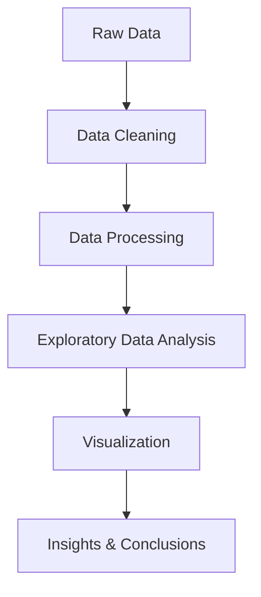
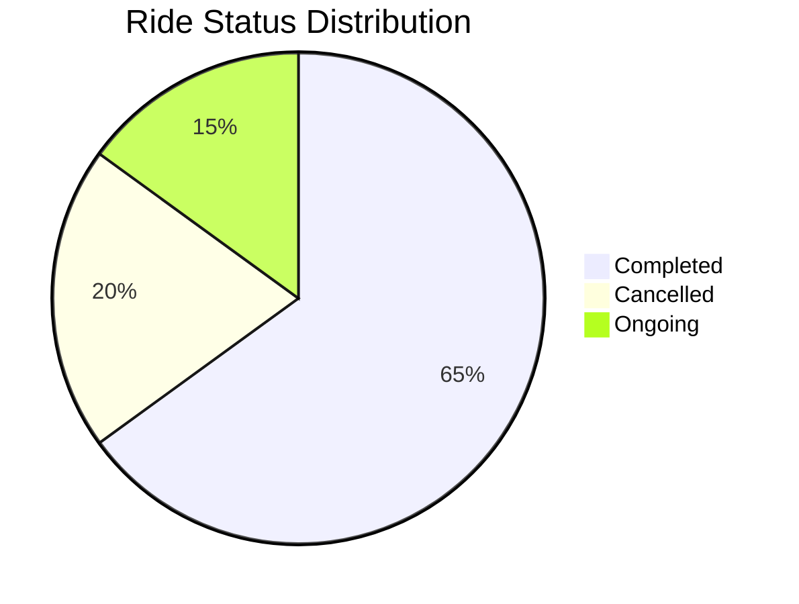

# 🚖 Uber Trip Analysis


---

## 📊 Overview

**Uber Trip Analysis** is a data-driven project focused on analyzing ride patterns, demand trends, and operational insights from Uber trip data. The goal is to uncover meaningful patterns that can help improve decision-making, optimize ride availability, and enhance user experience.

---

## 🎯 Objectives

* Analyze trip demand across different time periods
* Identify peak hours and high-demand locations
* Understand ride completion vs cancellation trends
* Generate actionable insights using visualizations

---

## ✨ Key Features

* 📈 Data analysis of trip records
* 📊 Interactive visualizations
* 🕒 Time-based trend analysis
* 📍 Location-based insights
* 📉 Ride status distribution (Completed / Cancelled / Ongoing)

---

## 🧠 Workflow



---

## 📊 Sample Visualizations



```mermaid
bar
    title Trips by Month
    "Jan" : 120
    "Feb" : 180
    "Mar" : 220
    "Apr" : 200
```

---

## 🛠️ Tech Stack

* **Language:** Python / JavaScript
* **Libraries:** Pandas, NumPy, Matplotlib, Seaborn
* **Visualization:** Charts, Graphs, Dashboards

---

## 🚀 Getting Started

### 1️⃣ Clone the Repository

```bash
git clone https://github.com/ayush-9955/Uber-Rides-.git
cd Uber-Rides-
```

### 2️⃣ Install Dependencies

```bash
pip install -r requirements.txt
```

### 3️⃣ Run Analysis

```bash
python main.py
```

---

## 📂 Project Structure

```
Uber-Rides-
│── data/
│── notebooks/
│── src/
│── visuals/
│── requirements.txt
│── README.md
```

---

## 📈 Insights You Can Derive

* 🚦 Peak traffic hours
* 📍 Most active pickup locations
* 💰 Revenue trends
* ❌ Cancellation patterns

---

## 🔮 Future Enhancements

* 🤖 Machine Learning for demand prediction
* 📍 Real-time data integration
* 📊 Interactive dashboard (Power BI / Tableau)
* 🌍 Geospatial heatmaps

---

## 🤝 Contributing

Contributions are welcome! Feel free to fork the repo and submit a pull request.

---

## 📜 License

This project is licensed under the MIT License.

---

## 👨‍💻 Author

**Ayush**
GitHub: [https://github.com/ayush-9955](https://github.com/ayush-9955)

---

⭐ If you find this project useful, consider giving it a star!
